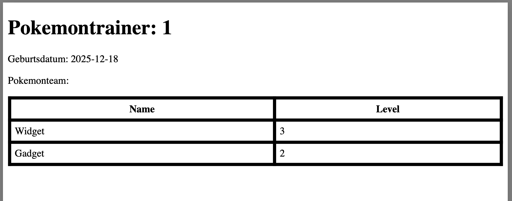
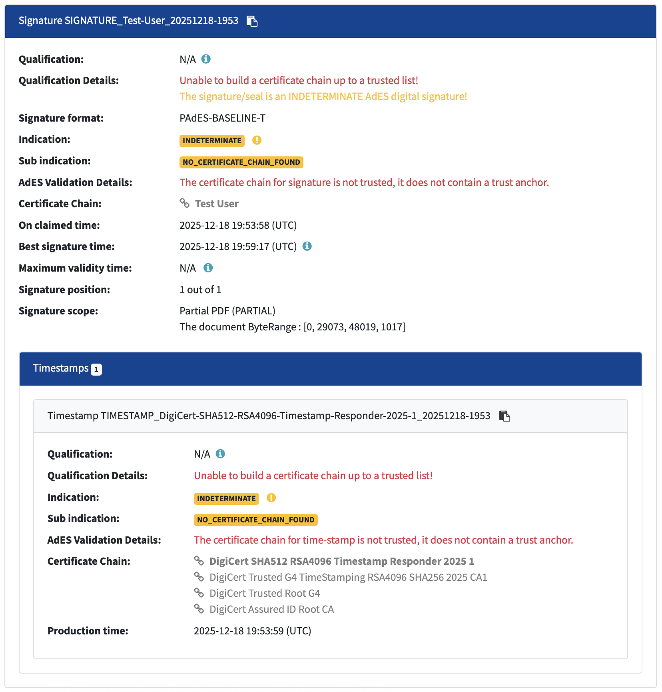

# Pdf-Assembly-Showcase
A Spring Boot microservice for generating PDFs from HTML using **Playwright Java** and signing them using *EU DSS* (profile: pades-lt).  
Supports headless Chromium execution, pre-installed browser binaries, and is optimized for CI/CD, Docker, and local development.

<p align="center" width="100%">

</p>

---

## Features

- Generate PDFs via Playwright from HTML templates via thymeleafe
- Headless Chromium support (new headless mode)
- Pre-download browsers at build time to avoid runtime downloads
- Compatible with Docker and restricted environments
- Signing of PDF's in compliance with ISO 32000-1, eIDAS, AdES (PAdES-LT), BSI TR-03138 – RESISCAN

---

## Requirements

- Java 25+
- Gradle 9.2+
- macOS, Linux, or Windows
- Optional: Docker for containerized builds

---

## Gradle Tasks

### 1. Install Playwright Chromium

Installs Playwright-managed Chromium (with OS dependencies) to the local cache:

```bash
./gradlew installPlaywrightChromium
```

### 2. Uninstall Playwright Chromium

Uninstalls all Playwright-managed browsers (with OS dependencies) to the local cache:

```bash
./gradlew uninstallPlaywrightChromium
```

## Build & run

Build the project (will run installPlaywrightChromium first):
```bash
./gradlew build
```

Run locally:
```bash
./gradlew bootRun
```

Download PDF
```bash
 open http://localhost:8080/create-pdf
```


## IntelliJ Setup

1. Open run config
2. Add before launch gradle task: installPlaywrightChromium

## Build with

- java v25
- spring boot v4
- thymeleafe v1.57

## Signing
The signing is done via [EU Digital Signature Service (DSS)](https://github.com/esig/dss).
The signing requires the following input (here for PDF signature level "pades" in profile "lt")

1. PKCE#12 File (see self-signed signing.p12): Bundles Signing Certificate (X.509) + its private key + intermediate ca + root ca (trust-chain has to be complete)
2. Input pdf (in bytes)
3. Timestamp provider (TSA-Source): For testing purposes set to "http://timestamp.digicert.com"
4. CertificateVerifier (OCSP / CRL Fetching): DSS will read the AIA-URLs for OCSP directly from the X.509-certificate (see first requirement)

The input parameters are defined in apps application.yaml.
The signature of the output-pdf can be validated by [DSS Validator WebApp](https://ec.europa.eu/digital-building-blocks/DSS/webapp-demo/validation)

<p align="center" width="100%">

</p>

Further fundamentals are described in [pdfSigning.pdf](docs/pdfSigning.pdf)

### Generate self-signed certificate
The self-signed certificate can be generated via following snipped:

```bash
keytool
    -genkeypair \
    -alias test-signing \
    -keyalg RSA \
    -keysize 2048 \
    -sigalg SHA256withRSA \
    -keystore signing.p12 \
    -storetype PKCS12 \
    -validity 3650 \
    -storepass password \
    -keypass password \
    -dname "CN=Test User, OU=PoC, O=Example, L=Berlin, C=DE"
```